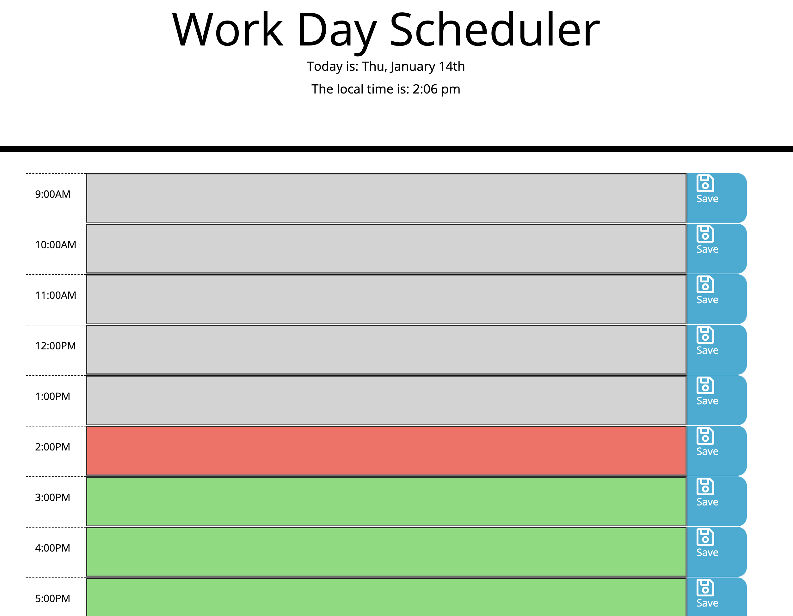

# Day Planner 
## Description
This planner breaks your day into hour long blocks of time from 9 am to 5 pm. Time blocks will change color depending on if they were in the past, present or future. The user can input a task into each time block, click the save button, and when they refresh the page, their input will be saved there. 
## Table of Contents
* [Installation Instructions](#installation)
* [Questions](#questions)

## Installation
Use deployed link

## License
MIT

## Questions
[Link to my Github](https://github.com/ejkennelly)

Contact email address if you have additional questions: elizakennelly@gmail.com

<<<<<<< HEAD

=======
>>>>>>> e27751884dbf385a261d04b5ef1e405bb4bcace7
